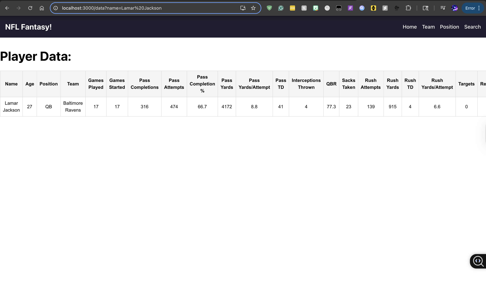
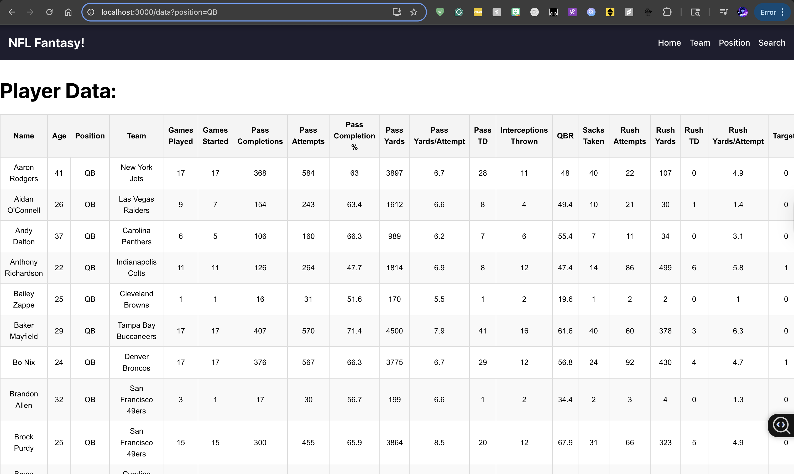
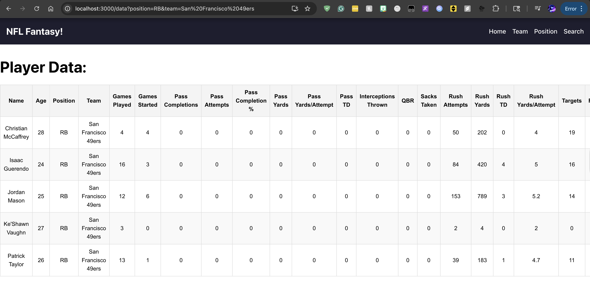
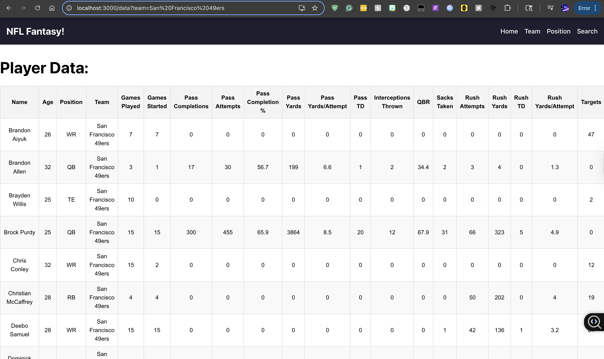

# NFL Fantasy Website
This is a NFL Fantasy Website which allows users to filter through different positions, teams, and specific players to look at their statistics from the previous season to help them create their 2025 NFL Fantasy teams!

This is a full-stack project that uses React.js for frontend and Spring Boot/PostgreSQL for backend. Additionally, I performed webscraping using BeautifulSoup of the Pro Football Reference website to create the dataset that I used: https://www.pro-football-reference.com/years/2024/.

Using a similar dataset I webscraped for this project, I created a machine learning model to predict 2024 match games using data from the 2022 and 2023 seasons. **Link: https://github.com/siddsaran/nfl-match-predictor**

# Steps
1. Find the URL of the 2024 NFL statistics and perform webscraping to create the csv data 
2. Use PostgreSQL to create a table in the database to put the csv contents in
3. Use Spring Boot backend to handle filtering the Player entities based on various factors, such as position, team, and name.
4. Use JavaScript and CSS frontend to have a dynamic display of the content and a smooth user interface

**Currently working on hosting backend**

# Screenshots of Website
While trying to fix backend hosting errors, here are screenshots showcasing the different filtering:

### Name filter

### Position filter

### Team and position filter

### Team filter

